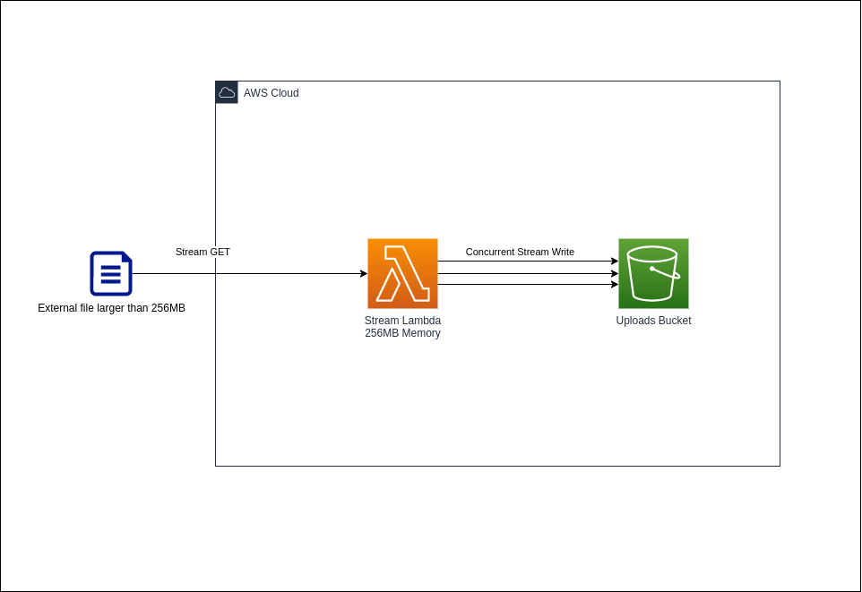

# AWS Lambda Duplex Stream to S3

> An example of how to stream large files to S3 from an external source on AWS
> Lambda using the JavaScript AWS SDK v3



## Motivation

In use cases where lambda needs to download and upload files that can range
widely in size, using a standard up-front download and upload flow will
require increasing the lambda memory configuration to be large enough to store
the file while the transfer occurs.

By using an approach with streams, the lambda memory configuration is no longer
a constraint, allowing us to process files of any size as long as the transfer
can occur within the maximum execution time (15 minutes).

## Prerequisites

To deploy this CDK application, you will need the following:

- [Node.js](https://nodejs.org/en/download/) v10 or later (LTS only)
- Docker (for building the lambda function)
- An AWS profile configured with valid IAM credentials

## Usage

Deploy the CDK stack by cloning this repository then running:

```bash
npm run build && npm run deploy
```

Run the `invoke.sh` script with a URL of large file (will take some time while
the lambda pulls in the file and uploads):

```bash
./invoke.sh "https://ai2-public-datasets.s3.us-west-2.amazonaws.com/arc/ARC-V1-Feb2018.zip" # 649 MB file
```

Your lambda will then stream the incoming data from your URL while streaming the
data to S3.

Open the [S3 Console](https://s3.console.aws.amazon.com/s3/home?region=us-east-1)
when the lambda has completed to see the file has been uploaded to your bucket.

## Cleaning Up

Run the following command to remove all of the resources created by this CDK stack.

```bash
npm run destroy
```

## Security

See [CONTRIBUTING](CONTRIBUTING.md#security-issue-notifications) for more information.

## License

This library is licensed under the MIT-0 License. See the LICENSE file.
